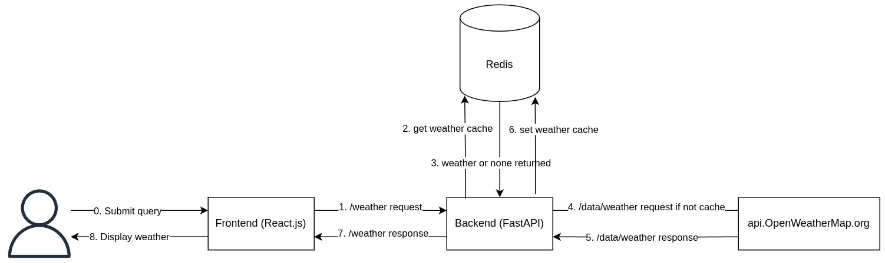
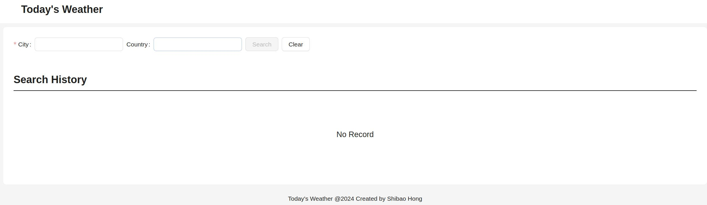
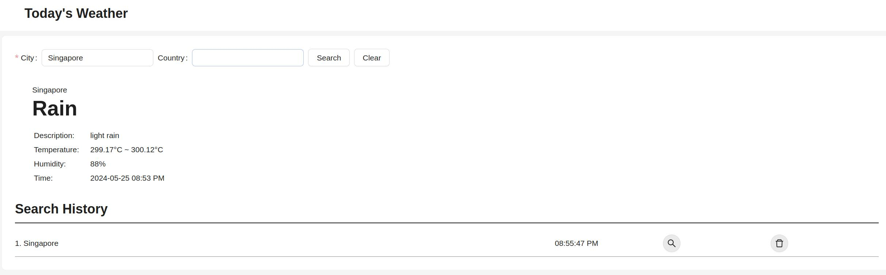
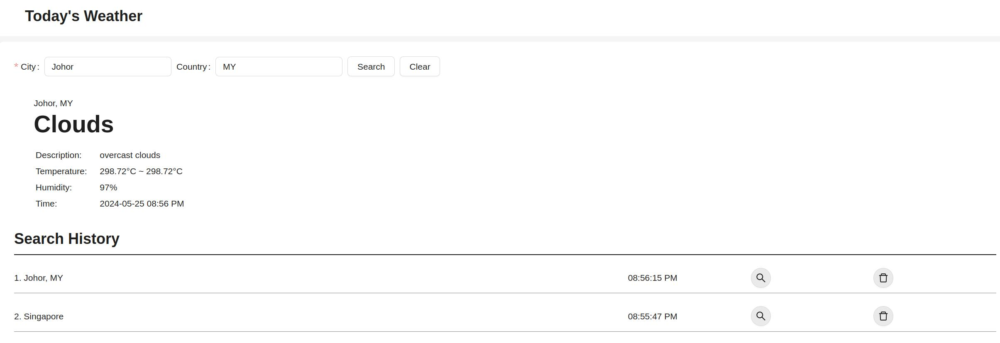
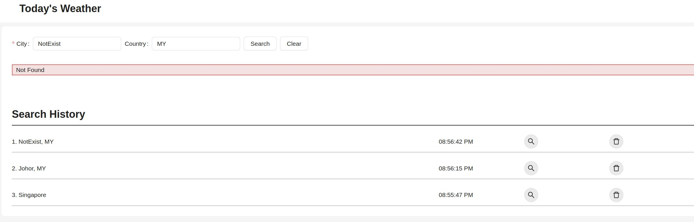
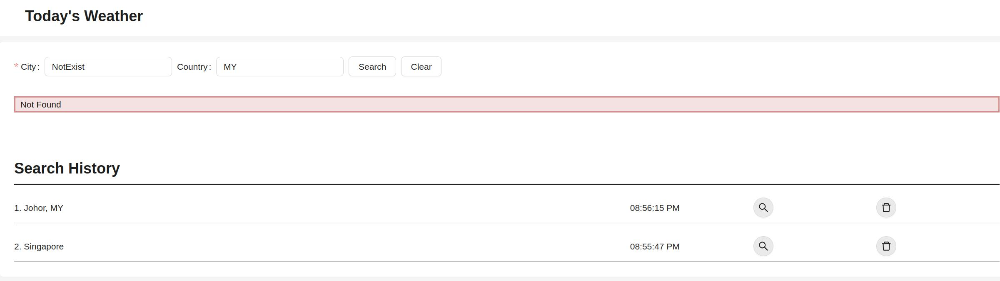
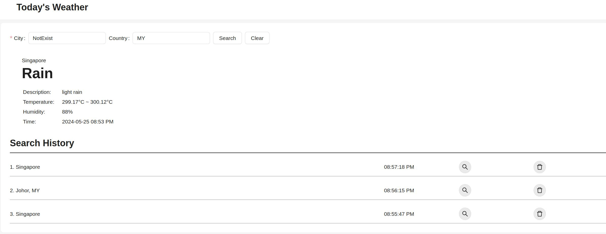
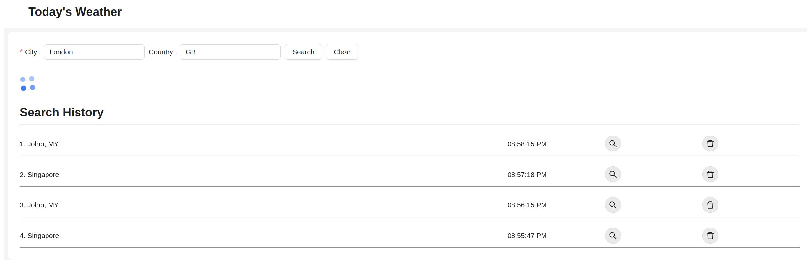
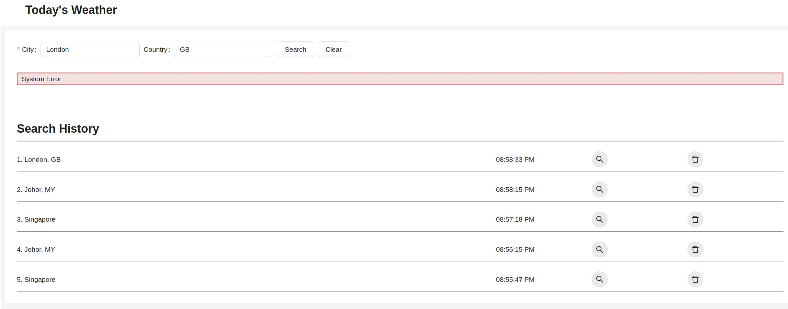

# todays-weather

## Design

Architecture and Flow:

This code repo includes both frontend and backend.

### Backend

The backend is implemented using Python:

* [FastAPI](https://fastapi.tiangolo.com/) is used as the web framework for building APIs due to its high performance.
* Redis is used to cache `/weather` API results with TTL.

### Frontend

The frontend is implemented using [React.js](https://react.dev/), and [Vite](https://vitejs.dev/) is used to generate the project template.

* Search history data is stored in `localStorage` of browsers.
* The `Weather` page component is inside [frontend/src/pages](./frontend/src/pages/) folder. It includes sub components `CityForm`, `WeatherResult`, and `SearchHistory`, to handle the three main business logic: city and country input and submit, weather info display, and search history management.

## UI Walk Through

0. The first time accessing the web UI:

1. Input City to query current weather:

2. Input City and Country to query current weather:

3. Input an invalid City:

4. Click the delete button of the first entry in Search History:

5. Click the search button of the second entry in Search History:

6. Slow query of weather info, a spin icon will display:

7. Mock backend error:

